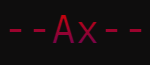
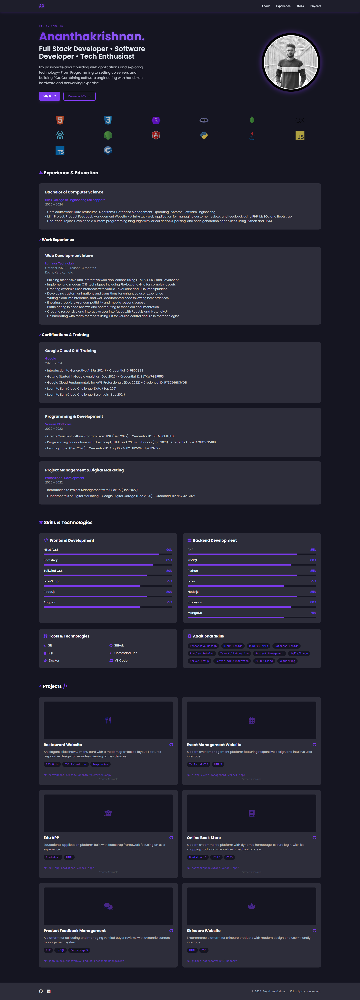
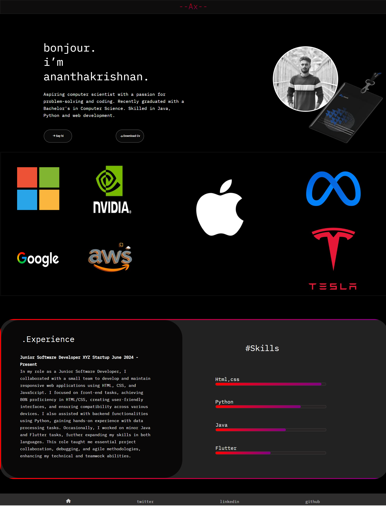

  

<h1 align="center">Portfolio</h1>

I am currently developing a portfolio as part of The MEAN Stack Internship, with an initial focus on HTML and CSS. This portfolio will continue to grow as I integrate additional languages and frameworks throughout the internship. My goal is to create a polished, website-ready portfolio that will effectively showcase my skills, projects, and experiences to the public.

  &#xa0;

>Crafting experiences, one line of code at a time.
  

 The following tools were used in this project:

- [HTML](https://developer.mozilla.org/en-US/docs/Web/HTML)
- [CSS](https://developer.mozilla.org/en-US/docs/Web/CSS)
- [JAVASCRIPT](https://developer.mozilla.org/en-US/docs/Web/Javascript)

  

## 2025

-New Much improved Personal Portfolio {2025}

## :checkered_flag: Old html&css page ##

-just a Page . Nothing Special!! {2024}

<a href="#top">Back to top</a>
